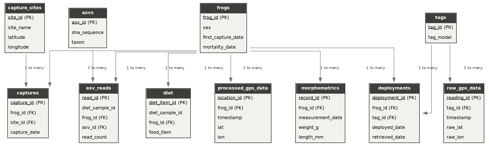
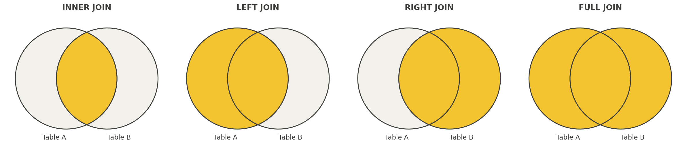

# The Basics of SQL

In the last chapter, we designed a relational database for our frog
fieldwork. Now we'll learn to actually talk to one. SQL, which stands for
Structured Query Language, is the standard language for retrieving and
manipulating data stored in a relational database. Whenever you interact
with a database in daily life (browsing an online store, searching a
library catalog), there's a good chance SQL is running behind the scenes.

Several database systems exist (Oracle, PostgreSQL, MySQL, SQLite), and
each uses a slightly different dialect of SQL. For this course, we'll use
SQLite, since it's lightweight and requires no separate server setup, our
entire database lives in a single file: `frogs.sqlite`.

## A first look at our practice database

This chapter uses a practice database that extends our running frog
example into a full relational system, and we'll use it throughout the
rest of the course.



It's made up of 10 tables:

- **frogs**: one row per individual, storing static information (sex,
  first capture date, mortality date if known)
- **capture_sites**: one row per site, storing its name and coordinates
- **captures**: one row per capture event, linking a frog to the site and
  date it was captured
- **morphometrics**: one row per biometric measurement, linked to the frog
  it was taken from
- **diet_asvs**: one row per unique Amplicon Sequence Variant detected
  across the whole study, with its DNA sequence and taxonomic
  identification
- **diet_asv_reads**: one row per ASV detected within a given diet sample,
  with a read count (the junction table for the many to many relationship
  between diet samples and ASVs)
- **tags**: one row per GPS tag deployed in the project
- **deployments**: one row per tag on frog deployment period, linking a
  specific frog to a specific tag over a date range
- **raw_gps_data**: one row per raw telemetry reading, as it came off the
  tag, linked to the tag that recorded it
- **processed_gps_data**: one row per cleaned, processed location, linked
  back to the frog it belongs to

Primary keys are unique identifiers within each table (frog ID, site ID,
tag ID, and so on). Foreign keys are the shared columns that connect
tables together (a frog ID appearing in the captures table, a tag ID
appearing in the deployments table). The diagram above shows how all ten
tables connect. Most relationships shown are one to many, except for the
diet sample to ASV relationship, which is many to many, handled through
the diet_asv_reads junction table.

Before going further, a quick note on what an ASV actually is. An
**Amplicon Sequence Variant (ASV)** is a unique DNA sequence recovered
from a metabarcoding sample, essentially, a distinct genetic "fingerprint"
that molecular methods can detect and compare, without necessarily knowing
in advance which species it belongs to. When a diet sample is run through
sequencing, the lab doesn't get a list of species names directly, it gets
a list of ASVs (DNA sequences) detected in that sample, each with a
"read count" reflecting how many times that particular sequence turned
up. Those ASVs are then compared against reference genetic databases to
assign a taxonomic identification, which is sometimes precise (down to
species) and sometimes only resolves to a broader level (family or
order), depending on how well-represented that organism is in existing
genetic reference libraries. This is exactly the structure of our
`diet_asvs` and `diet_asv_reads` tables from Chapter 5.

## Getting the practice database

Before we can query anything, you need a local copy of the course repository, since that's where `frogs.sqlite` lives. If you haven't already cloned it, revisit Chapter 3 for a full walkthrough of `git clone`. As a quick reminder, from your terminal:

```
git clone https://github.com/dcallen/Reproducible-Data-Science-and-Visualization.git
```

This creates a folder containing the entire course repository, including the `data/` folder where `frogs.sqlite` lives. If you already have the repo cloned from earlier chapters, just make sure it's up to date by running `git pull` from inside that folder.

## Setting your working directory in R

Throughout this chapter, we'll connect to the database using a relative
path: `"data/frogs.sqlite"`. As we covered back in Chapter 1, a relative
path is interpreted relative to your **working directory**, so before
connecting to anything, it's worth confirming R knows where you actually
are.

To check your current working directory:

```{r, eval=FALSE}
getwd()
```

If that's not the folder containing your `data/` subfolder (i.e., your
course-repo or project folder), you can change it with `setwd()`:

```{r, eval=FALSE}
setwd("/path/to/your/course-repo")
```

Replace the path above with your own. On Mac, use the file path tips from
Chapter 2: drag-and-drop the folder into a terminal, or Option+right-click
the folder and choose "Copy as Pathname." On Windows, navigate to the
folder in File Explorer, click into the address bar at the top, and copy
the path shown there.

## R packages for working with SQL data

We'll interact with our SQLite database from R, using two packages:
`DBI`, which provides a general interface for talking to databases, and
`RSQLite`, which lets `DBI` specifically talk to SQLite databases. Install
both if you haven't already:

```{r, eval=FALSE}
install.packages(c("DBI", "RSQLite"))
```

To connect to a database, we use `dbConnect()`. This creates a 
**connection object**. In R, an object is just a named piece of information 
that R keeps in memory so you can reuse it later,rather than recreating it from 
scratch every time. Here, we will call this object `con`, and it will store the 
open connection to your database. We'll reuse it for every query in this chapter, 
rather than reconnecting each time.

```{r, eval=FALSE}
library(DBI)

con <- dbConnect(RSQLite::SQLite(), "data/frogs.sqlite")
```

(Adjust the path if your `frogs.sqlite` file lives somewhere else relative
to your working directory.)

Once connected, we send SQL queries to the database using `dbGetQuery()`,
which takes the connection and a SQL query written as a text string, and
returns the result as an ordinary R data frame.

**Try it now:** Connect to the database and list the tables it contains.

```{r, eval=FALSE}
library(DBI)

con <- dbConnect(RSQLite::SQLite(), "data/frogs.sqlite")
dbListTables(con)
```

You should see all ten tables from our Chapter 5 schema: `frogs`,
`capture_sites`, `captures`, `morphometrics`, `diet_asvs`,
`diet_asv_reads`, `tags`, `deployments`, `raw_gps_data`, and
`processed_gps_data`.

Keep this connection open for the rest of the chapter, every example
below assumes `con` already exists. When you're done working with a
database, it's good practice to close the connection with
`dbDisconnect(con)`.

## Annotating your code

Before we start writing real queries, it's worth pausing on a habit you should build from the very start: leaving comments in your code. In R, anything following a `#` on a line is a comment, R ignores it completely when running your code. Comments don't change what your code does; they explain *why* it does it, for the benefit of anyone reading it later (including future you).

```{r, eval=FALSE}
# Connect to the practice database
con <- dbConnect(RSQLite::SQLite(), "data/frogs.sqlite")

# List every table in the database, just to confirm the connection worked
dbListTables(con)
```

A good rule of thumb: comment on *why* you're doing something, not just *what* the code does (the code itself already shows what it does). As queries get more complex later in this chapter, a short comment above each one explaining its purpose will make your scripts far easier to follow, both for you and for anyone you share them with.

## Writing SQL queries

An SQL query, or statement, always starts with a verb describing the
action you want to perform, and ends with a semicolon. The verb we'll use
constantly is `SELECT`, which retrieves data. `SELECT` is always followed
by `FROM`, telling SQL which table to pull from.

**Try it now:** Select the `frog_id` and `sex` columns from the `frogs`
table.

```{r, eval=FALSE}
dbGetQuery(con, "
  SELECT frog_id, sex
  FROM frogs;
")
```

To select every column, use the wildcard `*` instead of naming columns
individually:

```{r, eval=FALSE}
dbGetQuery(con, "
  SELECT *
  FROM frogs;
")
```

### Limiting results

If a table is large, you may only want to preview the first several rows.
The `LIMIT` clause does this:

**Try it now:** Preview the first 5 rows of `morphometrics`.

```{r, eval=FALSE}
dbGetQuery(con, "
  SELECT *
  FROM morphometrics
  LIMIT 5;
")
```

### Sorting results

SQL does not guarantee any particular row order unless you ask for one.
Use `ORDER BY` to sort explicitly. The default is ascending order; add
`DESC` for descending.

**Try it now:** Find the 5 heaviest frogs on record.

```{r, eval=FALSE}
dbGetQuery(con, "
  SELECT frog_id, weight_g, measurement_date
  FROM morphometrics
  ORDER BY weight_g DESC
  LIMIT 5;
")
```

### Finding unique values

`SELECT DISTINCT` returns only the unique values in a column, useful for
seeing what categories exist in your data.

**Try it now:** Find every taxonomic order detected in the diet data.

```{r, eval=FALSE}
dbGetQuery(con, "
  SELECT DISTINCT order_name
  FROM diet_asvs;
")
```

### Filtering

The `WHERE` clause filters rows based on a logical condition.

**Try it now:** Find every frog that is female.

```{r, eval=FALSE}
dbGetQuery(con, "
  SELECT *
  FROM frogs
  WHERE sex = 'female';
")
```

Combine multiple conditions with `AND` (all conditions must be true) or
`OR` (at least one must be true). `IN` is a shorthand for checking against
a list of values, and `!=` means "not equal to."

**Try it now:** Find female frogs with no recorded mortality date (still
presumed alive), using `AND`.

```{r, eval=FALSE}
dbGetQuery(con, "
  SELECT *
  FROM frogs
  WHERE sex = 'female' AND mortality_date IS NULL;
")
```

`IN` is a shorthand for checking a column against a list of values, rather
than writing multiple `OR` conditions by hand. The list goes inside
parentheses, separated by commas: `IN ('Value A', 'Value B')`.

**Try it now:** Find every ASV assigned to either Diptera or Hemiptera,
using `IN` instead of writing out `OR` twice.

```{r, eval=FALSE}
dbGetQuery(con, "
  SELECT *
  FROM diet_asvs
  WHERE order_name IN ('Diptera', 'Hemiptera');
")
```

### Calculations

SQL can perform calculations on the fly, inside a query, rather than
requiring you to pre-compute a new column. This is handy both in `SELECT`
(to compute a new value) and in `WHERE` (to filter based on a computed
condition).

**Try it now:** Convert weight from grams to kilograms, and filter to
frogs weighing more than 0.02 kg.

```{r, eval=FALSE}
dbGetQuery(con, "
  SELECT frog_id, weight_g, weight_g / 1000.0 AS weight_kg
  FROM morphometrics
  WHERE weight_g / 1000.0 > 0.02;
")
```

(You can include comments in SQL using two dashes, `--`, same as we just
saw with `weight_kg`.)

### Aggregate functions and aliases

Aggregate functions summarize an entire column into a single value:
`COUNT`, `AVG`, `MIN`, `MAX`, and `SUM` are the most common. `AS` creates
an **alias**, a temporary name for the result column, which makes output
much easier to read.

**Try it now:** Find the number of morphometric records, and the average,
minimum, and maximum recorded weight.

```{r, eval=FALSE}
dbGetQuery(con, "
  SELECT
    COUNT(*) AS n_records,
    AVG(weight_g) AS mean_weight,
    MIN(weight_g) AS min_weight,
    MAX(weight_g) AS max_weight
  FROM morphometrics;
")
```

### Grouping

`GROUP BY` applies an aggregate function separately within each group,
rather than across the whole table at once.

**Try it now:** Count how many frogs of each sex are in the database.

```{r, eval=FALSE}
dbGetQuery(con, "
  SELECT sex, COUNT(*) AS n_frogs
  FROM frogs
  GROUP BY sex;
")
```

### Filtering based on computed values

`WHERE` can't filter on the result of an aggregate function, since `WHERE`
is evaluated before aggregation happens. For that, use `HAVING` instead,
in combination with `GROUP BY`.

**Try it now:** Find frogs that have been captured more than twice.

```{r, eval=FALSE}
dbGetQuery(con, "
  SELECT frog_id, COUNT(*) AS n_captures
  FROM captures
  GROUP BY frog_id
  HAVING n_captures > 2;
")
```

### Null values

Missing values in SQL are represented as `NULL`, and are tested with `IS
NULL` or `IS NOT NULL` (not `= NULL`, which will not work as expected).

**Try it now:** Find frogs with no recorded mortality date (i.e., still
presumed alive).

```{r, eval=FALSE}
dbGetQuery(con, "
  SELECT *
  FROM frogs
  WHERE mortality_date IS NULL;
")
```

### Joins

Every concept so far has queried a single table. But the entire point of
a relational database is combining information across tables, and that's
what **joins** do. A join uses a shared column (a foreign key) to line up
rows from two tables.

When joining, the first table named is the **left** table, and the second
is the **right** table. A **left join** keeps every row from the left
table, filling in matching information from the right table wherever it
exists, and leaving it blank (`NULL`) where it doesn't. An **inner join**
keeps only rows that have a match in both tables.

The four main join types differ in which rows they keep from each table. The diagram below shows this visually: the shaded region is what ends up in your result.



- **Inner join**: keeps only rows with a match in both tables (the overlap).
- **Left join**: keeps every row from the left table, matched with the right table wherever possible.
- **Right join**: keeps every row from the right table, matched with the left table wherever possible.
- **Full join**: keeps every row from both tables, matched wherever possible.

For this course, we'll mostly use left joins, since it's the most common case: keeping every row from your main table of interest (like `frogs`), while pulling in matching details from a related table wherever they exist. A quick note on SQLite specifically: `RIGHT JOIN` and `FULL JOIN` were only added in SQLite version 3.39 (2022), so depending on your installed version, those two might not work, `LEFT JOIN` and `INNER JOIN` (or just `JOIN`, which means the same thing as `INNER JOIN`) are supported everywhere and cover the vast majority of what you'll need.

Not every frog was fitted with a GPS tag. If we left join `frogs` to
`deployments`, we get every frog, with deployment information filled in
only for the frogs that were actually tagged.

**Try it now:** Left join `frogs` to `deployments`.

```{r, eval=FALSE}
dbGetQuery(con, "
  SELECT frogs.frog_id, sex, deployment_id, tag_id, deployed_date
  FROM frogs
  LEFT JOIN deployments
  ON frogs.frog_id = deployments.frog_id
  LIMIT 10;
")
```

Notice that `frog_id` appears in both tables, so we had to specify
`frogs.frog_id` in the `ON` clause and in the column list, to avoid
ambiguity, this is the `table.column` syntax.

Joins are also how we work with the many to many relationship from
Chapter 5. Recall that `diet_asv_reads` is a junction table linking diet
samples to `diet_asvs`. To see the actual taxonomic identity behind each
read count, rather than just a bare `asv_id`, we join the two tables
together.

**Try it now:** Join `diet_asv_reads` to `diet_asvs` to see which taxa
were detected in each frog's diet, along with read counts.

```{r, eval=FALSE}
dbGetQuery(con, "
  SELECT
    diet_asv_reads.frog_id,
    diet_asv_reads.diet_sample_id,
    diet_asvs.order_name,
    diet_asvs.family,
    diet_asv_reads.read_count
  FROM diet_asv_reads
  LEFT JOIN diet_asvs
  ON diet_asv_reads.asv_id = diet_asvs.asv_id
  ORDER BY diet_asv_reads.frog_id, diet_asv_reads.read_count DESC
  LIMIT 15;
")
```

Joins can also be combined with everything else we've learned. For
example, we can join, then group and aggregate, to answer a real
ecological question: which prey order contributes the most total reads
across the whole study?

**Try it now:** Find total read count by prey order.

```{r, eval=FALSE}
dbGetQuery(con, "
  SELECT diet_asvs.order_name, SUM(diet_asv_reads.read_count) AS total_reads
  FROM diet_asv_reads
  LEFT JOIN diet_asvs
  ON diet_asv_reads.asv_id = diet_asvs.asv_id
  GROUP BY diet_asvs.order_name
  ORDER BY total_reads DESC;
")
```

## In-Class Activity: Querying the Frog Database

For this activity, work individually or in pairs. You'll use the same
`frogs.sqlite` database from this chapter to answer a series of ecological
questions, building on each concept covered above.

### Setup

Start every query from this same connection. Run this first:

```{r, eval=FALSE}
library(DBI)

con <- dbConnect(RSQLite::SQLite(), "data/frogs.sqlite")
dbListTables(con)
```

### Worked example

Before writing your own queries, here's a fully worked example to use as
a template. Question: **Which capture site has the most recorded
captures?**

```{r, eval=FALSE}
dbGetQuery(con, "
  SELECT capture_sites.site_name, COUNT(*) AS n_captures
  FROM captures
  LEFT JOIN capture_sites
  ON captures.site_id = capture_sites.site_id
  GROUP BY capture_sites.site_name
  ORDER BY n_captures DESC;
")
```

This combines a join (linking `captures` to `capture_sites` to get a
readable site name instead of a bare ID), a `GROUP BY`, an aggregate
function, and an `ORDER BY`, the same pattern you'll use for the questions
below.

### Your turn

Using the same connection (`con`), write and run a query to answer each
of the following. Use `dbGetQuery()` exactly as shown above, just change
the SQL string.

1. **How many distinct frogs have never had a recorded diet sample?**
   (Hint: think about which frog IDs appear in `frogs` but never appear in
   `diet_asv_reads`. You may find a `LEFT JOIN` combined with `WHERE ...
   IS NULL` useful here.)
2. **What is the average weight of male frogs versus female frogs?** (Hint:
   you'll need to join `frogs` to `morphometrics`, then group by sex.)
3. **Which tag model has been deployed the most times?** (Hint: join
   `deployments` to `tags`.)
4. **List every frog that has tested positive for Chironomidae in its
   diet** (i.e., appears in `diet_asv_reads` linked to a `diet_asvs` row
   where `family = 'Chironomidae'`).
5. **Which capture site has the highest average frog weight, among frogs
   caught there?** (Hint: this requires joining three tables: `captures`,
   `capture_sites`, and `morphometrics`.)

### What to submit

Submit an RMarkdown document (or plain R script) containing all five
queries and their output, along with one sentence per question stating
the answer in plain English.

## References

- SQLite documentation: <https://www.sqlite.org/docs.html>
- `DBI` package documentation: <https://dbi.r-dbi.org/>
